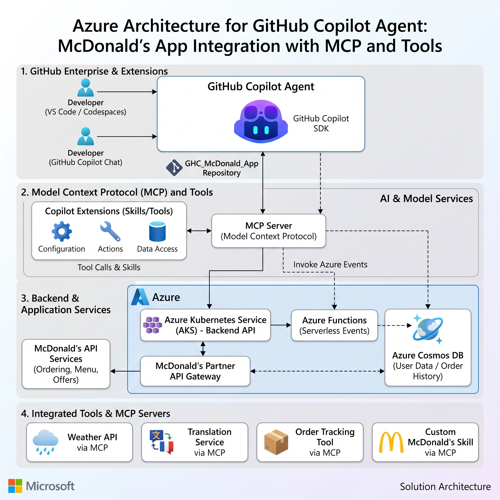

# Golden Order Copilot

[简体中文](README.zh.md)



Golden Order Copilot is an unofficial, McDonald's-inspired ordering demo built with the
**GitHub Copilot Python SDK**, `gpt-6-astra`, custom tools, and the official McDonald's
China MCP server.

The application supports Simplified Chinese, Traditional Chinese, and English. Users can
chat immediately, browse a simulated menu, query official MCP data, build a cart, confirm a
simulated order, and generate or send an order confirmation email.

> This project is a technical demonstration and is not affiliated with, endorsed by, or
> operated by McDonald's Corporation or its affiliates.

## Highlights

- GitHub Copilot Python SDK session orchestration
- Configurable `gpt-6-astra` model and reasoning effort
- Official McDonald's China Streamable HTTP MCP integration
- MCP-assisted store, menu, coupon, campaign, account, and price queries
- Custom Copilot SDK tools for simulated menu lookup, pricing, order creation, and email
- Explicit confirmation gate before a simulated order is created
- Safe Markdown rendering for tables, lists, links, emphasis, and code
- Responsive McDonald's-inspired UI for desktop and mobile
- Runtime language switching: Simplified Chinese, Traditional Chinese, and English
- All credentials and runtime parameters stored in `.env`

## Architecture

```text
Browser
├── Responsive menu and cart
├── Language switcher
├── Markdown chat renderer
└── POST /api/chat
        │
        ▼
FastAPI application
├── Request validation
├── Cart and locale context
└── OrderingAgent
        │
        ▼
GitHub Copilot Python SDK
├── Model: gpt-6-astra
├── Ordering system instructions
├── Custom application tools
│   ├── get_menu
│   ├── calculate_order
│   ├── create_order
│   └── send_order_email
└── Official McDonald's MCP tools
    ├── available-coupons
    ├── query-my-coupons
    ├── campaign-calendar
    ├── query-my-account
    ├── query-nearby-stores
    ├── delivery-query-stores
    ├── query-meals
    ├── query-meal-detail
    ├── query-store-coupons
    └── calculate-price
        │
        ▼
https://mcp.mcd.cn
```

## Project Structure

```text
GHC_McDonal_App/
├── app/
│   ├── __init__.py
│   ├── agent.py          # Copilot SDK sessions, tools, MCP routing, and language context
│   ├── agent_tools.py    # Custom simulated-order and email tools
│   ├── catalog.py        # Demo menu and RMB price calculation
│   ├── config.py         # Typed .env configuration
│   ├── emailer.py        # Console preview and SMTP delivery
│   ├── main.py           # FastAPI routes and application lifecycle
│   ├── orders.py         # In-memory simulated order store
│   └── static/
│       ├── app.js        # UI state, i18n, chat, cart, and safe Markdown renderer
│       ├── index.html    # Single-page application shell
│       └── styles.css    # Responsive McDonald's-inspired presentation
├── tests/
│   └── test_catalog.py
├── .env.example
├── .gitignore
├── pyproject.toml
├── README.md
└── README.zh.md
```

## Copilot SDK Flow

1. FastAPI starts one `CopilotClient` in isolated `empty` mode.
2. Each browser session receives an independent Copilot conversation.
3. The selected language and cart are attached to every user turn.
4. Custom tools handle only the local simulated-order workflow.
5. Read-only McDonald's business queries are routed to the official MCP server.
6. The agent collects required delivery mode, location, and store information before invoking
   store-dependent MCP tools.
7. Official product codes returned by `query-meals` are never replaced with local demo IDs.
8. A simulated order is created only after the user explicitly confirms its items and total.

## Official MCP Configuration

The integration follows the McDonald's China MCP documentation:

- Endpoint: `https://mcp.mcd.cn`
- Transport: Streamable HTTP
- Authentication: `Authorization: Bearer <MCP_TOKEN>`

Only read-only tools are exposed to the agent. Real order creation, cancellation, and automatic
coupon redemption are intentionally excluded.

## Requirements

- Python 3.11 or newer
- An authenticated GitHub Copilot environment
- A McDonald's China MCP token
- Optional SMTP credentials for real email delivery

## Setup

```bash
python -m venv .venv
source .venv/bin/activate
pip install --index-url https://packagefeedproxy.microsoft.io/pypi/simple -e ".[dev]"
python -m copilot download-runtime
cp .env.example .env
```

Configure `.env`:

```dotenv
COPILOT_MODEL=gpt-6-astra
COPILOT_REASONING_EFFORT=high

MCD_MCP_URL=https://mcp.mcd.cn
MCD_MCP_TOKEN=your_mcp_token

EMAIL_MODE=console
SMTP_HOST=
SMTP_PORT=587
SMTP_USERNAME=
SMTP_PASSWORD=
SMTP_FROM_EMAIL=no-reply@example.com
SMTP_USE_TLS=true
```

Never commit `.env` or share the MCP token and SMTP password.

## Run

```bash
source .venv/bin/activate
uvicorn app.main:app --reload
```

Open <http://127.0.0.1:8000>.

If port 8000 is occupied:

```bash
uvicorn app.main:app --reload --port 8765
```

## Email Modes

| Mode | Behavior |
|---|---|
| `console` | Prints a safe email preview to the server console |
| `smtp` | Sends a real email through the configured SMTP server |

For QQ Mail, use an SMTP authorization code instead of the account password.

## Validation

```bash
node --check app/static/app.js
ruff check .
pytest
```

## Security Notes

- `.env` is excluded from Git.
- MCP and SMTP secrets are never sent to the browser.
- MCP authorization is added only to the server-side Streamable HTTP connection.
- Assistant Markdown is HTML-escaped before formatting.
- The official MCP integration is restricted to read-only tools.
- Simulated cart IDs are not treated as official McDonald's product codes.

